<p align="center">
  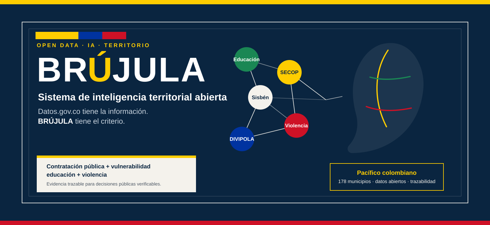
</p>

<h1 align="center">BRÚJULA</h1>

<p align="center">
  <strong>Sistema de inteligencia territorial abierta del Pacífico colombiano.</strong><br />
  <em>Datos.gov.co tiene la información. BRÚJULA tiene el criterio.</em>
</p>

<p align="center">
  <a href="https://brujula-pacifico.vercel.app"><strong>Demo en producción</strong></a>
  ·
  <a href="EVALUACION.md"><strong>Guía para jurados</strong></a>
  ·
  <a href="docs/evidence/competition-matrix.md"><strong>Matriz de evidencias</strong></a>
  ·
  <a href="docs/reproducibilidad.md"><strong>Reproducir</strong></a>
  ·
  <a href="docs/ARQUITECTURA.md"><strong>Arquitectura</strong></a>
  ·
  <a href="docs/CRISP-ML.md"><strong>Metodología</strong></a>
  ·
  <a href="docs/DATOS.md"><strong>Fuentes</strong></a>
  ·
  <a href="docs/DEPLOY.md"><strong>Deploy</strong></a>
  ·
  <a href="RECURSOS/README.md"><strong>Presentación</strong></a>
</p>

<p align="center">
  
  
  
  
  
  
  <a href="LICENSE"></a>
</p>

> BRÚJULA participa en el Concurso Datos al Ecosistema 2026 - IA para Colombia. Este README es a la vez vitrina pública, documento técnico, guía de auditoría y ruta de reproducción. No afirma métricas, premios, usuarios, precisión ni disponibilidad que no estén respaldados por el repositorio, las capturas o el deployment.

## Índice

- [En 30 segundos](#en-30-segundos)
- [Hallazgo de Apertura](#hallazgo-de-apertura)
- [El Problema](#el-problema)
- [La Respuesta](#la-respuesta)
- [Demo Visual](#demo-visual)
- [Product Tour](#product-tour)
- [Módulos](#módulos)
- [Datos Abiertos](#datos-abiertos)
- [Hallazgos Confirmados](#hallazgos-confirmados)
- [Arquitectura General](#arquitectura-general)
- [Arquitectura Agéntica](#arquitectura-agéntica)
- [Pipeline de Datos](#pipeline-de-datos)
- [Metodología y CRISP-ML](#metodología-y-crisp-ml)
- [Score de Olvido](#score-de-olvido)
- [Clasificación Sectorial](#clasificación-sectorial)
- [Simulador Honesto](#simulador-honesto)
- [Modelo de Datos](#modelo-de-datos)
- [Innovación Técnica](#innovación-técnica)
- [Impacto y Escalabilidad](#impacto-y-escalabilidad)
- [Accesibilidad y Brecha Digital](#accesibilidad-y-brecha-digital)
- [IA Responsable](#ia-responsable)
- [Rigor de Datos](#rigor-de-datos)
- [Alineación con el Concurso](#alineación-con-el-concurso)
- [Recorrido para Jurados](#recorrido-para-jurados)
- [Stack](#stack)
- [Estructura del Repositorio](#estructura-del-repositorio)
- [Inicio Rápido](#inicio-rápido)
- [Reproducción de Datos](#reproducción-de-datos)
- [Scripts](#scripts)
- [Deployment](#deployment)
- [Calidad y CI](#calidad-y-ci)
- [Documentación](#documentación)
- [Roadmap](#roadmap)
- [Contribución](#contribución)
- [Licencia y Autoría](#licencia-y-autoría)

## En 30 segundos

BRÚJULA cruza contratación pública, vulnerabilidad, educación, violencia y geografía para responder una pregunta concreta: **¿la inversión pública está llegando donde más se necesita?**

El sistema toma datos abiertos de datos.gov.co, los normaliza por municipio DIVIPOLA, los consulta desde una aplicación web y permite explorarlos mediante dashboard, agente IA, ranking de zonas olvidadas, comparador, simulador, desglose sectorial, exportaciones, brief PDF, bitácora, WhatsApp y modo PWA/offline.

Para jurados: la evidencia está en producción, en las capturas reales y en los scripts de reproducción.<br />
Para desarrolladores: el proyecto es Next.js 16, TypeScript, Supabase/PostgreSQL, Anthropic Claude, Twilio, Puppeteer/Chromium y Vercel Functions.<br />
Para entidades públicas: el LLM no es la fuente de verdad; las cifras salen de herramientas conectadas a datos reales y dejan trazabilidad.

## Hallazgo de Apertura

En el Pacífico colombiano, BRÚJULA encontró que **Argelia, Cauca** aparece primera en el ranking de olvido territorial: registra 93.4% de vulnerabilidad, 55 homicidios, 9 contratos SECOP geolocalizados y apenas **$39.006 COP por persona vulnerable estimada** en el periodo disponible. El score resultante es 0.949, con calidad SECOP `ok`.

Ese hallazgo no dice que el Estado esté ausente en términos absolutos. Dice algo más auditable: con las fuentes abiertas integradas por BRÚJULA, Argelia combina alta vulnerabilidad, violencia relativa y baja inversión geolocalizada por población vulnerable. Esa combinación merece revisión pública.

<table>
  <tr>
    <th>Dato público</th>
    <th>Evidencia encontrada</th>
    <th>Pregunta que abre</th>
  </tr>
  <tr>
    <td>SECOP II geolocalizado</td>
    <td>9 contratos por $888.745.168 COP en Argelia</td>
    <td>¿Qué inversión no está llegando al nivel municipal o no está bien geolocalizada?</td>
  </tr>
  <tr>
    <td>Sisbén IV agregado</td>
    <td>93.4% de vulnerabilidad; población vulnerable estimada de 22.785 personas</td>
    <td>¿Cómo priorizar municipios con mayor necesidad sin usar datos personales?</td>
  </tr>
  <tr>
    <td>Medicina Legal</td>
    <td>55 homicidios en el registro integrado</td>
    <td>¿Qué territorios necesitan análisis intersectorial y no solo presupuestal?</td>
  </tr>
</table>

datos.gov.co contiene la evidencia. BRÚJULA conecta contratación, vulnerabilidad, educación y violencia para convertir esa evidencia en decisiones verificables.

## El Problema

Los datos públicos existen, pero suelen estar separados por entidad, formato, vocabulario y granularidad. SECOP habla de contratos; Sisbén habla de vulnerabilidad; Educación habla de sedes; Medicina Legal habla de violencia; DIVIPOLA permite unir el territorio. Sin una capa de interpretación, la ciudadanía y muchas alcaldías quedan frente a tablas que no responden preguntas públicas.

El problema no es solo técnico:

- los datos viven fragmentados;
- la contratación se analiza separada de necesidades sociales;
- los hallazgos dependen de saber consultar APIs y limpiar municipios;
- la ciudadanía no siempre tiene computador o conectividad estable;
- la memoria institucional se pierde entre administraciones;
- una cifra sin fuente, contexto y salvedad puede inducir malas decisiones.

## La Respuesta

BRÚJULA transforma:

```text
Datos abiertos -> contexto territorial -> criterio público -> decisión verificable -> trazabilidad
```

La plataforma permite ver el territorio, preguntar en lenguaje natural, detectar zonas olvidadas, comparar municipios, simular escenarios de inversión, entender el gasto por sector, exportar datos reutilizables y generar briefs ejecutivos con fuentes citadas.

La regla central es simple: **la IA no inventa cifras**. Cuando el copiloto responde, usa herramientas reales sobre Supabase o sobre el catálogo de datos.gov.co. Cuando no hay suficiente evidencia, debe decirlo.

## Demo Visual

El video demo no aplica para esta entrega. La demostración principal es el deployment público y las capturas reproducibles generadas contra producción:

<p align="center">
  <a href="https://brujula-pacifico.vercel.app">
    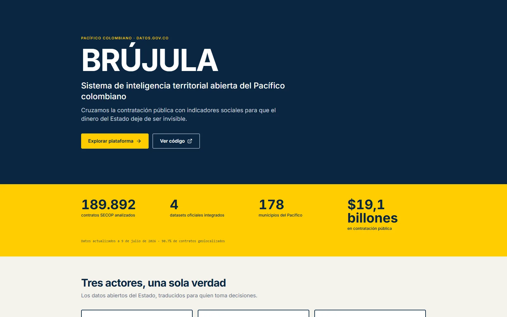
  </a>
</p>

<p align="center">
  <strong><a href="https://brujula-pacifico.vercel.app">Abrir demo en producción</a></strong>
</p>

Las capturas se generaron con `scripts/capture-readme-screenshots.ts` contra `https://brujula-pacifico.vercel.app`. La trazabilidad completa está en [docs/assets/readme/README-ASSETS.md](docs/assets/readme/README-ASSETS.md).

## Product Tour

### Comprender el territorio

<table>
  <tr>
    <td width="50%">
      <a href="https://brujula-pacifico.vercel.app/dashboard">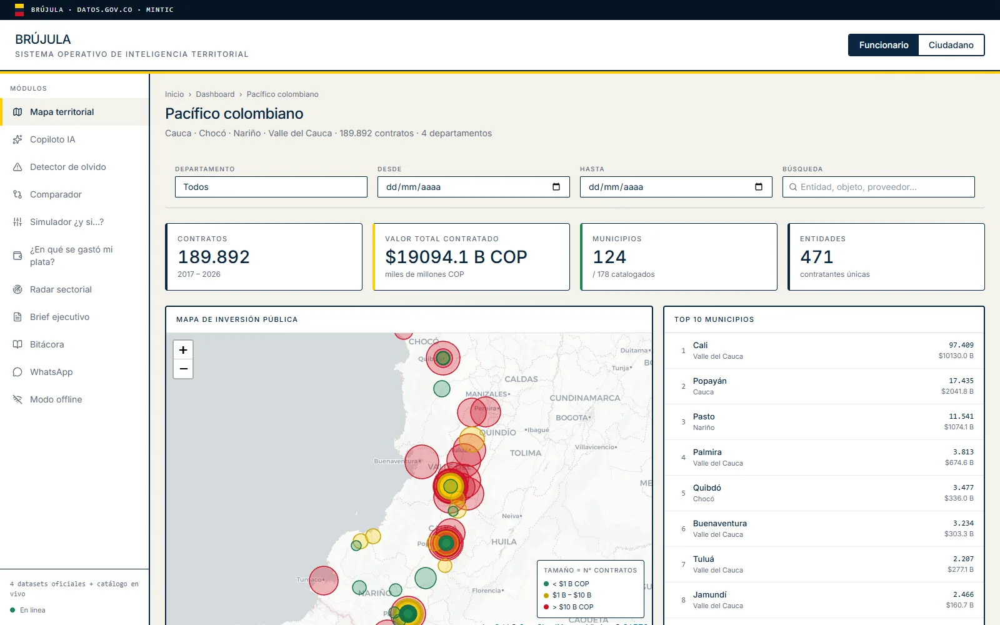</a>
      <br /><strong>Dashboard territorial</strong>
      <br />Mapa, filtros y KPIs de contratación. Evidencia para el concurso: exploración visual de datos abiertos georreferenciados.
    </td>
    <td width="50%">
      <a href="https://brujula-pacifico.vercel.app/zonas-olvidadas">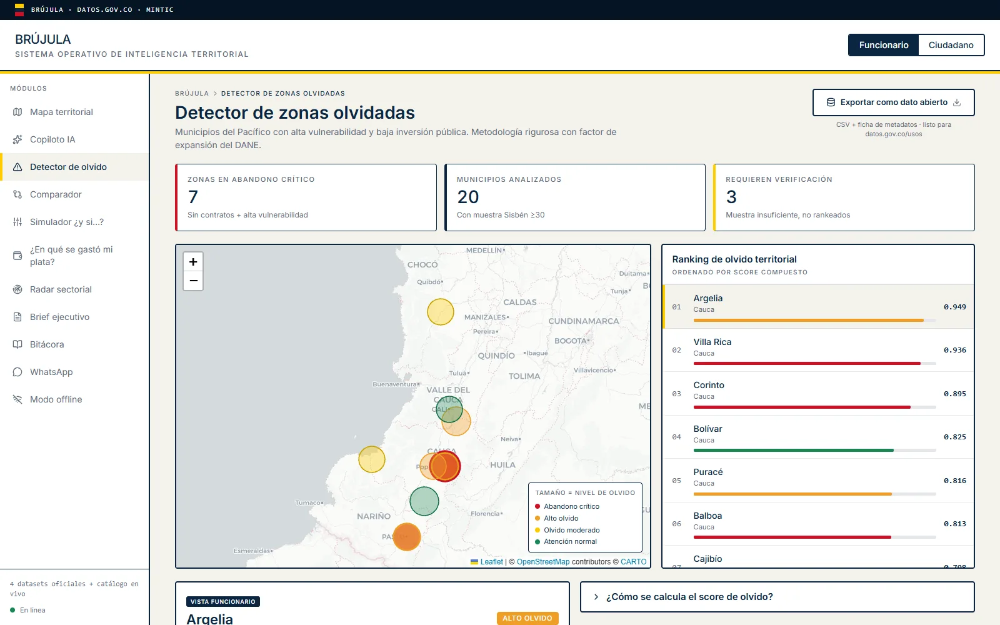</a>
      <br /><strong>Detector de zonas olvidadas</strong>
      <br />Ranking auditable con score, calidad de dato y municipios que requieren verificación.
    </td>
  </tr>
  <tr>
    <td width="50%">
      <a href="https://brujula-pacifico.vercel.app/radar">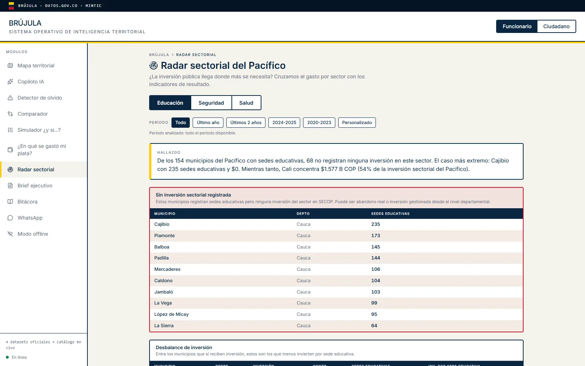</a>
      <br /><strong>Radar sectorial</strong>
      <br />Cruza gasto sectorial con indicadores de resultado. Muestra desbalances sin afirmar causalidad.
    </td>
    <td width="50%">
      <a href="https://brujula-pacifico.vercel.app/bitacora">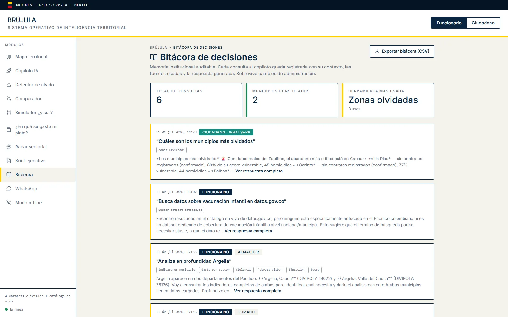</a>
      <br /><strong>Bitácora</strong>
      <br />Memoria institucional: consultas, herramientas, datasets y contexto para auditoría posterior.
    </td>
  </tr>
</table>

### Preguntar y decidir

<table>
  <tr>
    <td width="50%">
      <a href="https://brujula-pacifico.vercel.app/agente">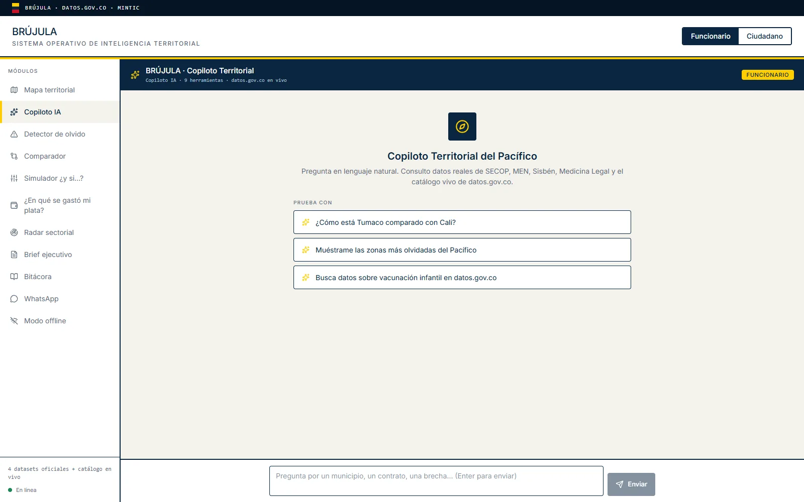</a>
      <br /><strong>Copiloto IA</strong>
      <br />Interfaz agéntica con herramientas reales sobre SECOP, Sisbén, Educación, Medicina Legal y Socrata.
    </td>
    <td width="50%">
      <a href="https://brujula-pacifico.vercel.app/comparador">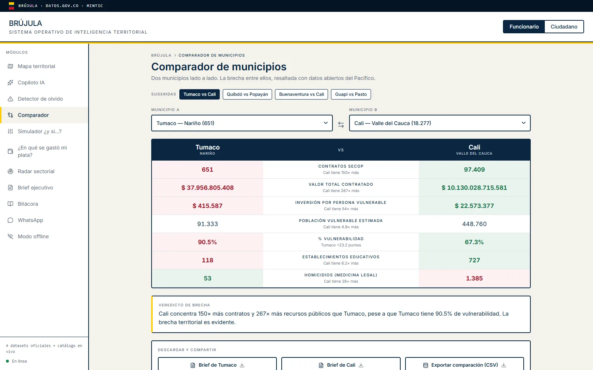</a>
      <br /><strong>Comparador</strong>
      <br />Contrasta municipios lado a lado. La captura muestra Tumaco frente a Cali con brecha de inversión por persona vulnerable.
    </td>
  </tr>
  <tr>
    <td width="50%">
      <a href="https://brujula-pacifico.vercel.app/simulador">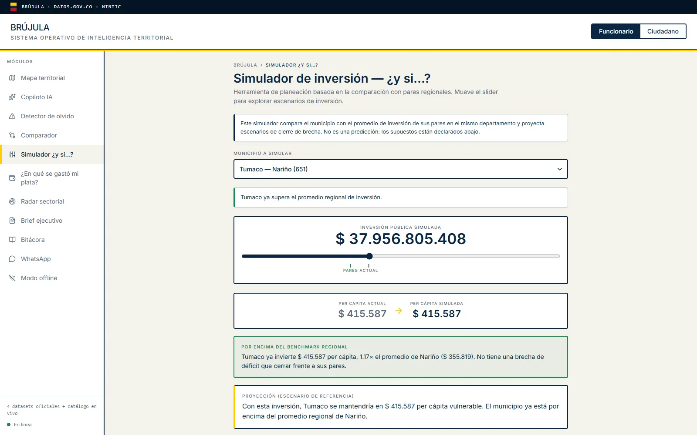</a>
      <br /><strong>Simulador ¿y si...?</strong>
      <br />Escenarios comparados con pares regionales. Declara supuestos y no se presenta como predicción causal.
    </td>
    <td width="50%">
      <a href="https://brujula-pacifico.vercel.app/brief">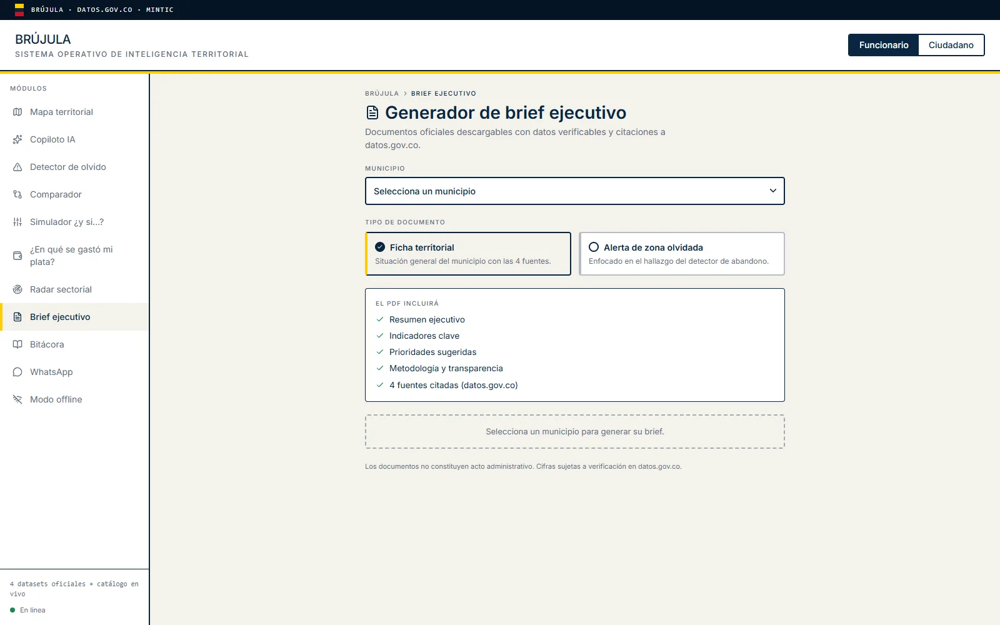</a>
      <br /><strong>Brief ejecutivo</strong>
      <br />Interfaz de generación PDF con citaciones. La captura valida interfaz; la descarga PDF debe probarse después de cada deployment.
    </td>
  </tr>
</table>

### Transparencia ciudadana y acceso universal

<table>
  <tr>
    <td width="50%">
      <a href="https://brujula-pacifico.vercel.app/mi-plata">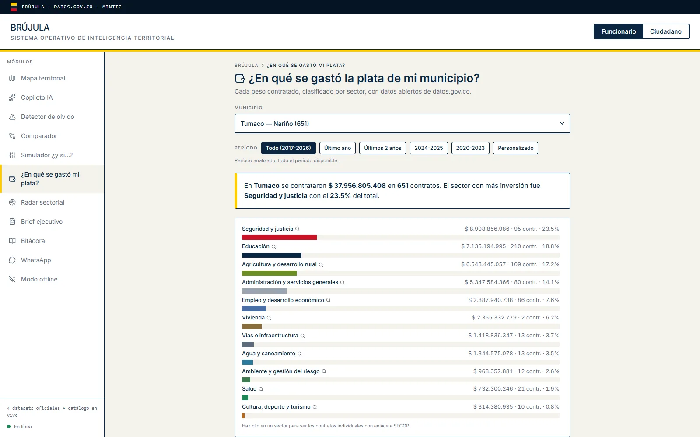</a>
      <br /><strong>¿En qué se gastó mi plata?</strong>
      <br />Desglose sectorial ciudadano con contratos verificables y exportación CSV.
    </td>
    <td width="50%">
      <a href="https://brujula-pacifico.vercel.app/whatsapp">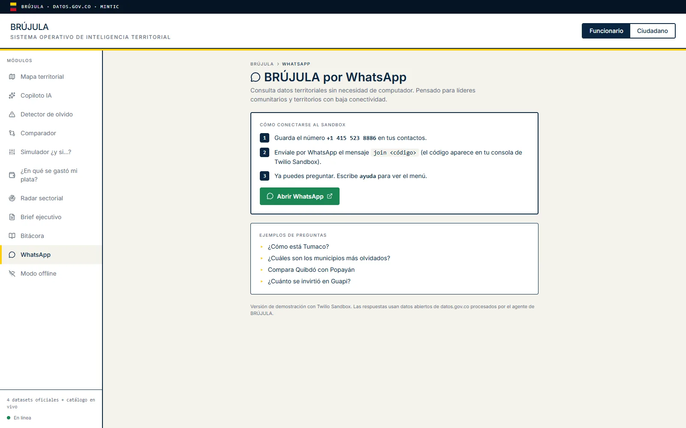</a>
      <br /><strong>WhatsApp</strong>
      <br />Canal para territorios con baja conectividad. Usa Twilio Sandbox y webhook server-side.
    </td>
  </tr>
  <tr>
    <td width="50%">
      <a href="https://brujula-pacifico.vercel.app/offline">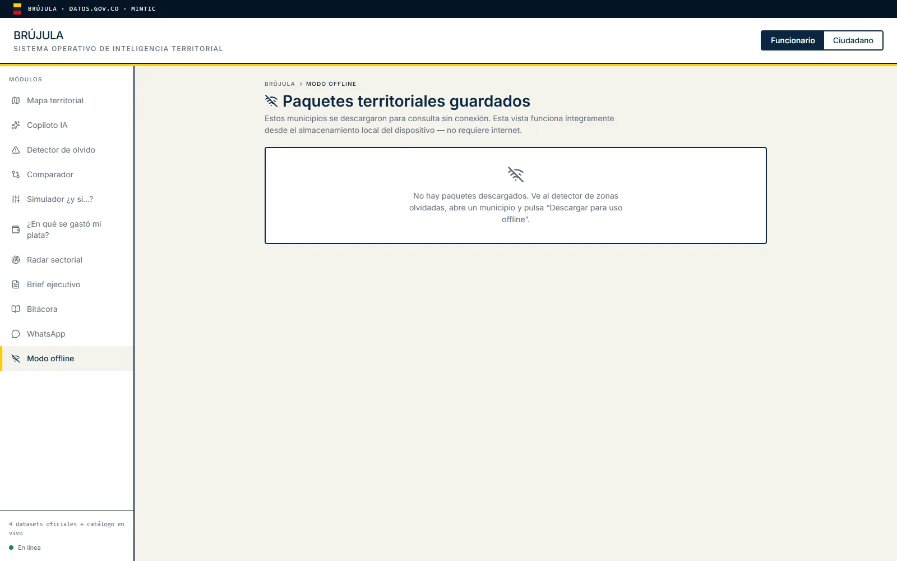</a>
      <br /><strong>PWA y modo offline</strong>
      <br />Consulta local de paquetes territoriales descargados. En una sesión limpia muestra que no hay paquetes guardados.
    </td>
    <td width="50%">
      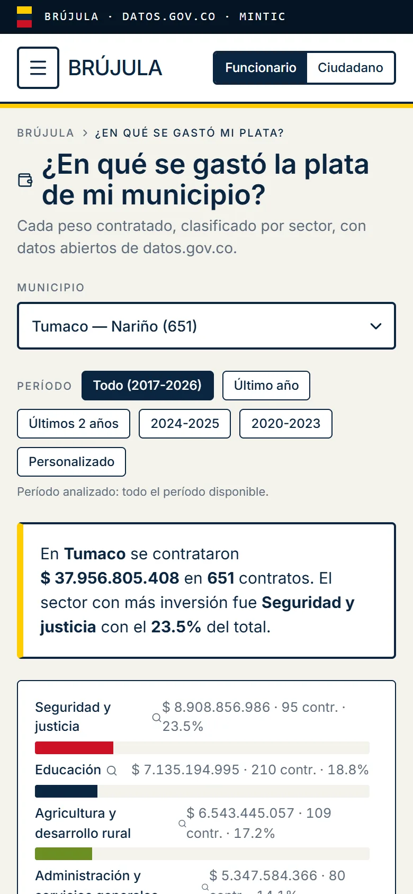
      <br /><strong>Responsive móvil</strong>
      <br />Acceso ciudadano desde teléfono. La landing móvil está en `13-mobile-landing.webp`.
    </td>
  </tr>
</table>

## Módulos

| Ruta | Módulo | Usuario | Pregunta que responde | Evidencia generada |
|---|---|---|---|---|
| `/` | Landing | Jurado, ciudadanía, desarrolladores | ¿Qué es BRÚJULA y qué cubre? | Métricas principales, fuentes y accesos |
| `/dashboard` | Mapa territorial | Funcionarios, analistas | ¿Dónde se concentra la contratación pública? | KPIs, mapa, filtros, ranking y tabla SECOP |
| `/agente` | Copiloto IA | Funcionarios, periodistas, ciudadanía | ¿Qué evidencia territorial existe sobre un municipio o tema? | Respuesta con herramientas, fuentes y salvedades |
| `/zonas-olvidadas` | Detector de olvido | Alcaldías, control social | ¿Qué municipios combinan alta vulnerabilidad y baja inversión? | Score, ranking, calidad del dato, exportación |
| `/comparador` | Comparador | Jurados, periodistas, planeación | ¿Cómo se diferencian dos municipios? | Brecha de inversión, vulnerabilidad, educación y violencia |
| `/simulador` | Simulador ¿y si...? | Planeación, alcaldías | ¿Qué pasa si cambia la inversión frente a pares? | Escenario, benchmark y supuestos |
| `/mi-plata` | Desglose sectorial | Ciudadanía | ¿En qué se gastó la plata de mi municipio? | Barras sectoriales, contratos y CSV |
| `/radar` | Radar sectorial | Analistas | ¿La inversión por sector acompaña indicadores de resultado? | Hallazgos descriptivos por educación, seguridad y salud |
| `/brief` | Brief ejecutivo | Funcionarios, jurados | ¿Cómo convertir evidencia en documento descargable? | PDF con indicadores y fuentes, si la función está disponible |
| `/bitacora` | Bitácora | Entidades y equipos técnicos | ¿Qué se preguntó, con qué fuentes y qué respondió el sistema? | Registro institucional auditable |
| `/whatsapp` | Canal WhatsApp | Liderazgos territoriales | ¿Cómo consultar sin computador? | Interfaz pública y webhook de Twilio |
| `/offline` | PWA offline | Territorios con baja conectividad | ¿Qué puedo consultar sin internet después de descargar paquetes? | Paquetes guardados en almacenamiento local |

## Datos Abiertos

BRÚJULA usa datasets públicos y agregados. No integra datos personales de Sisbén en la interfaz; trabaja con agregaciones territoriales.

| Dataset | ID Socrata | Entidad | Uso en BRÚJULA | Cobertura | Actualización | Enlace |
|---|---|---|---|---|---|---|
| SECOP II - contratos electrónicos | `jbjy-vk9h` | Colombia Compra Eficiente | Contratación, montos, fechas, entidad, proveedor, objeto contractual | Pacífico filtrado y geolocalizado | Según datos.gov.co y proceso de ingesta | `https://www.datos.gov.co/resource/jbjy-vk9h.json` |
| Sisbén IV | `hq2v-5umk` | DNP / Prosperidad Social | Vulnerabilidad agregada y factor de expansión `fex` | Municipios integrados del Pacífico | Snapshot procesado | `https://www.datos.gov.co/resource/hq2v-5umk.json` |
| Establecimientos educativos | `cfw5-qzt5` | Ministerio de Educación Nacional | Sedes educativas por municipio | Municipios del Pacífico | Snapshot procesado | `https://www.datos.gov.co/resource/cfw5-qzt5.json` |
| Lesiones fatales | `2kpj-cktv` | Instituto Nacional de Medicina Legal | Homicidios y violencia relativa | Municipios integrados | Snapshot procesado | `https://www.datos.gov.co/resource/2kpj-cktv.json` |
| DIVIPOLA | Complementaria | DANE | Llave territorial, nombres, departamentos, coordenadas | Cauca, Chocó, Nariño, Valle del Cauca | Catálogo local | `lib/divipola/pacifico.ts` |
| Catálogo vivo datos.gov.co | API Socrata catalog | datos.gov.co | Búsqueda agéntica de datasets no precargados | Nacional | En vivo | herramienta `buscar_dataset_datosgovco` |

Patrón de API:

```text
https://www.datos.gov.co/resource/{id}.json
```

## Hallazgos Confirmados

Los siguientes hallazgos son descriptivos. No establecen causalidad ni sustituyen verificación administrativa.

| Hallazgo | Cifra | Fuente | Interpretación | Limitación | Pregunta pública |
|---|---:|---|---|---|---|
| Cobertura territorial | 178 municipios del Pacífico | Landing y catálogo DIVIPOLA | El sistema cubre Cauca, Chocó, Nariño y Valle del Cauca | Algunos módulos dependen de datos disponibles por fuente | ¿Qué municipios siguen sin datos suficientes? |
| Contratación procesada | 189.892 contratos; $19,1 billones COP | `/api/dashboard/kpis`, landing | Permite análisis de contratación geolocalizada | 90.7% geolocalizado; puede haber inversión no asignada a municipio | ¿Qué contratos quedan sin georreferenciar? |
| Argelia, Cauca | Score 0.949; 93.4% vulnerabilidad; 55 homicidios; 9 contratos | `/api/zonas` | Prioridad para revisión territorial | Score no es acto administrativo | ¿Por qué su inversión por vulnerable es tan baja? |
| Educación sectorial | 68 municipios con sedes educativas no registran inversión educativa sectorial en SECOP | `/radar` | Señala desbalance o inversión no geolocalizada/gestionada desde otro nivel | El indicador educativo no se filtra por periodo; inversión sí | ¿Dónde falta georreferenciación sectorial? |
| Cajíbio, Cauca | 235 sedes educativas y $0 sectorial educativo registrado | `/radar` | Caso extremo para auditoría sectorial | No implica ausencia total de política educativa | ¿La inversión está clasificada en otro sector o nivel? |
| Tumaco vs Cali | Tumaco: $415.587 COP por persona vulnerable; Cali: $22.573.377 COP | `/api/comparador`, captura | Brecha territorial visible con datos abiertos | Comparación descriptiva; municipios no son equivalentes | ¿Cómo contextualizar inversión con vulnerabilidad? |
| Zonas críticas | Villa Rica y Corinto aparecen con cero contratos verificados | `/api/zonas` | Casos de abandono crítico según metodología vigente | Requiere revisar calidad SECOP y contratación departamental | ¿Qué debe verificar control social? |

## Arquitectura General

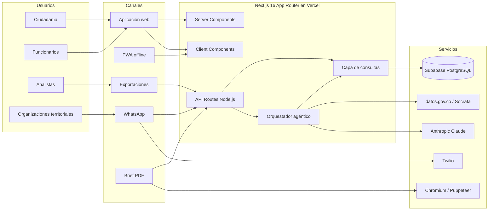
```mermaid
flowchart LR
  subgraph Usuarios
    C[Ciudadanía]
    F[Funcionarios]
    A[Analistas]
    O[Organizaciones territoriales]
  end
  subgraph Canales
    Web[Aplicación web]
    PWA[PWA offline]
    WA[WhatsApp]
    CSV[Exportaciones]
    PDF[Brief PDF]
  end
  subgraph Next[Next.js 16 App Router en Vercel]
    SC[Server Components]
    CR[Client Components]
    API[API Routes Node.js]
    Q[Capa de consultas]
    Agent[Orquestador agéntico]
  end
  subgraph Servicios
    DB[(Supabase PostgreSQL)]
    Socrata[datos.gov.co / Socrata]
    Claude[Anthropic Claude]
    Twilio[Twilio]
    Chromium[Chromium / Puppeteer]
  end
  C --> Web
  F --> Web
  A --> CSV
  O --> WA
  Web --> SC
  Web --> CR
  PWA --> CR
  WA --> API
  CSV --> API
  PDF --> API
  API --> Q
  API --> Agent
  Q --> DB
  Agent --> Q
  Agent --> Socrata
  Agent --> Claude
  WA --> Twilio
  PDF --> Chromium
```

Capas reales:

- Presentación: App Router, Server Components, Client Components, Tailwind v4 y componentes `components/brujula`.
- Aplicación: API routes bajo `app/api`.
- Inteligencia: `lib/agent`, tool use, streaming SSE y prompts con reglas de fuente.
- Datos: `lib/queries`, RPC SQL, Supabase/PostgreSQL.
- Integraciones: datos.gov.co/Socrata, Anthropic, Twilio, Puppeteer/Chromium.
- Infraestructura: Vercel con runtime Node.js para rutas que lo requieren.
- Trazabilidad: bitácora, exportaciones, fuentes y documentos técnicos.

Copias Mermaid de los diagramas están en [docs/assets/readme/diagrams](docs/assets/readme/diagrams).

## Arquitectura Agéntica

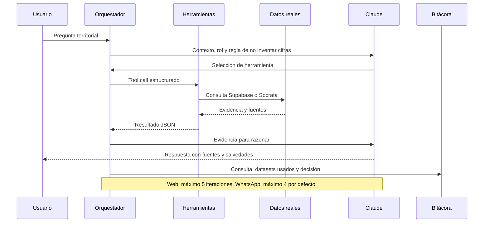
```mermaid
sequenceDiagram
  participant U as Usuario
  participant O as Orquestador
  participant T as Herramientas
  participant D as Datos reales
  participant L as Claude
  participant B as Bitácora
  U->>O: Pregunta territorial
  O->>L: Contexto, rol y regla de no inventar cifras
  L->>O: Selección de herramienta
  O->>T: Tool call estructurado
  T->>D: Consulta Supabase o Socrata
  D-->>T: Evidencia y fuentes
  T-->>O: Resultado JSON
  O->>L: Evidencia para razonar
  L-->>U: Respuesta con fuentes y salvedades
  O->>B: Consulta, datasets usados y decisión
  Note over O,L: Web: máximo 5 iteraciones. WhatsApp: máximo 4 por defecto.
```

Herramientas reales confirmadas en `lib/agent/tools.ts`:

| Herramienta | Fuente | Función | Salida | Trazabilidad |
|---|---|---|---|---|
| `consultar_indicadores_municipio` | Supabase | Resumen territorial por municipio | Indicadores integrados | Fuentes por dataset |
| `consultar_secop` | SECOP II | Contratos y montos | Contratos filtrados | URL/proceso cuando existe |
| `consultar_educacion` | MEN | Sedes educativas | Totales por municipio | Dataset `cfw5-qzt5` |
| `consultar_pobreza_sisben` | Sisbén IV | Vulnerabilidad agregada | Conteos y proporciones | Dataset `hq2v-5umk` |
| `consultar_violencia` | Medicina Legal | Violencia/homicidios | Indicadores territoriales | Dataset `2kpj-cktv` |
| `detectar_zonas_olvidadas` | RPC/Supabase | Ranking de olvido | Score, categoría, calidad | Metodología SQL |
| `buscar_dataset_datosgovco` | Catálogo Socrata | Búsqueda viva de datasets | Resultados del catálogo | URL datos.gov.co |
| `consultar_gasto_por_sector` | SECOP clasificado | Desglose sectorial | Sectores, montos, contratos | Clasificación sectorial |
| `consultar_cruce_sectorial` | SECOP + indicadores | Radar sectorial | Desbalance por indicador | Fuentes cruzadas |

El agente web usa streaming SSE en `app/api/agent/chat/route.ts`; WhatsApp usa `lib/agent/run-agent.ts` con respuesta no streaming para el webhook.

## Pipeline de Datos

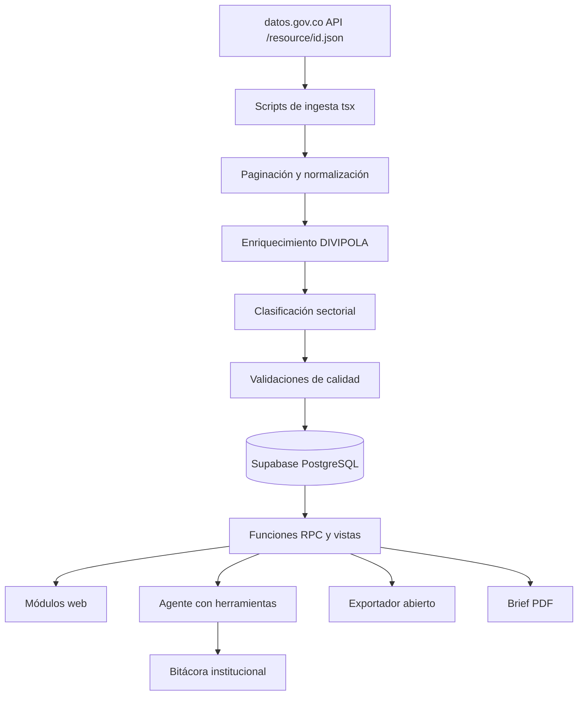
```mermaid
flowchart TD
  A[datos.gov.co API /resource/id.json] --> B[Scripts de ingesta tsx]
  B --> C[Paginación y normalización]
  C --> D[Enriquecimiento DIVIPOLA]
  D --> E[Clasificación sectorial]
  E --> F[Validaciones de calidad]
  F --> G[(Supabase PostgreSQL)]
  G --> H[Funciones RPC y vistas]
  H --> I[Módulos web]
  H --> J[Agente con herramientas]
  H --> K[Exportador abierto]
  H --> L[Brief PDF]
  J --> M[Bitácora institucional]
```

Las ingestas se ejecutan de forma local o controlada; **no corren durante el deployment de Vercel**.

Fases técnicas:

1. Extracción Socrata con paginación.
2. Normalización de campos reales.
3. Emparejamiento municipal con DIVIPOLA.
4. Enriquecimiento de coordenadas y población.
5. Clasificación sectorial de objetos SECOP.
6. Validación de cobertura, fechas, balance Sisbén y zonas.
7. Persistencia en Supabase/PostgreSQL.
8. Agregación server-side mediante SQL/RPC.
9. Consumo por módulos, agente, exportador y PDF.

## Metodología y CRISP-ML

BRÚJULA documenta su proceso con CRISP-ML(Q) en [docs/CRISP-ML.md](docs/CRISP-ML.md):

| Fase | Implementación en el repo |
|---|---|
| Entendimiento del problema | README, `docs/DATOS.md`, `docs/ANALISIS-PERIODO.md` |
| Entendimiento de datos | scripts `inspect-*`, documentación de fuentes y APIs Socrata |
| Preparación | `scripts/ingest-*`, `scripts/enrich-*`, `scripts/seed-*` |
| Modelado | score heurístico, clasificador sectorial híbrido y agente con herramientas |
| Evaluación | `scripts/validate-data.ts`, `validate:zonas`, `validate:sisben-balance` |
| Despliegue | Next.js/Vercel, Supabase, rutas Node.js, `docs/DEPLOY.md` |
| Monitoreo y trazabilidad | bitácora, logs, exportaciones y documentación metodológica |

No hay un modelo predictivo entrenado en el repositorio. La IA se usa para orquestación, lenguaje natural, clasificación auxiliar y generación de respuestas con evidencia.

## Score de Olvido

Fórmula vigente confirmada en código y SQL:

```text
Score =
  0.40 * baja inversión por persona vulnerable
+ 0.30 * vulnerabilidad
+ 0.30 * violencia relativa
```

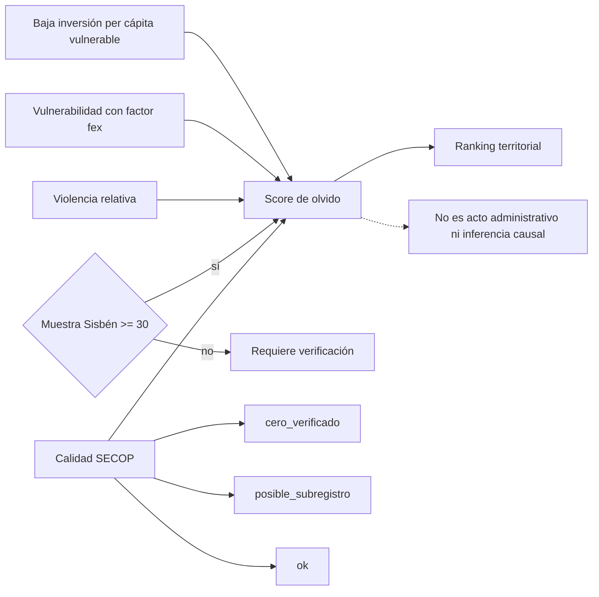
```mermaid
flowchart LR
  A[Baja inversión per cápita vulnerable] --> S[Score de olvido]
  B[Vulnerabilidad con factor fex] --> S
  C[Violencia relativa] --> S
  G{Muestra Sisbén >= 30} -->|sí| S
  G -->|no| V[Requiere verificación]
  Q[Calidad SECOP] --> S
  S --> R[Ranking territorial]
  Q --> Q1[cero_verificado]
  Q --> Q2[posible_subregistro]
  Q --> Q3[ok]
  S -.-> N[No es acto administrativo ni inferencia causal]
```

Elementos metodológicos:

- `fex`: factor de expansión DANE/Sisbén usado para estimar población vulnerable.
- Gate `>= 30`: municipios con muestra Sisbén insuficiente salen del ranking y pasan a verificación.
- `cero_verificado`: no hay contratos geolocalizados y la calidad departamental permite tratar el cero como hallazgo.
- `posible_subregistro`: puede haber contratación departamental o sin municipio preciso.
- Normalización: combina magnitudes heterogéneas en un score comparable.

> El score prioriza revisión y focalización; no constituye una declaración administrativa ni una inferencia causal.

## Clasificación Sectorial

La clasificación de contratos se implementa en `lib/clasificacion`.

Sectores:

1. Educación
2. Salud
3. Seguridad y justicia
4. Agua y saneamiento
5. Vías e infraestructura
6. Agricultura y desarrollo rural
7. Ambiente y gestión del riesgo
8. Cultura, deporte y turismo
9. Vivienda
10. Empleo y desarrollo económico
11. Administración y servicios generales
12. Otro

Método:

- reglas por palabras clave para objetos contractuales evidentes;
- fallback LLM con `claude-haiku-4-5-20251001` cuando hay ambigüedad;
- salida normalizada a sector;
- uso aproximado y verificable contrato por contrato en SECOP.

Límite explícito: la clasificación sectorial ayuda a navegar la contratación, pero no reemplaza auditoría jurídica del objeto contractual.

## Simulador Honesto

El simulador compara un municipio con pares del mismo departamento. Usa inversión por persona vulnerable y un benchmark regional para construir escenarios.

Lo que sí hace:

- muestra inversión actual;
- estima inversión per cápita vulnerable;
- compara contra pares;
- permite mover un slider;
- declara supuestos;
- distingue municipios por encima, por debajo o en línea con el promedio.

Lo que no hace:

- no predice resultados sociales;
- no estima causalidad;
- no modela corrupción, ejecución parcial, capacidad institucional ni choques externos;
- no promete que más inversión produzca automáticamente mejores indicadores.

## Modelo de Datos

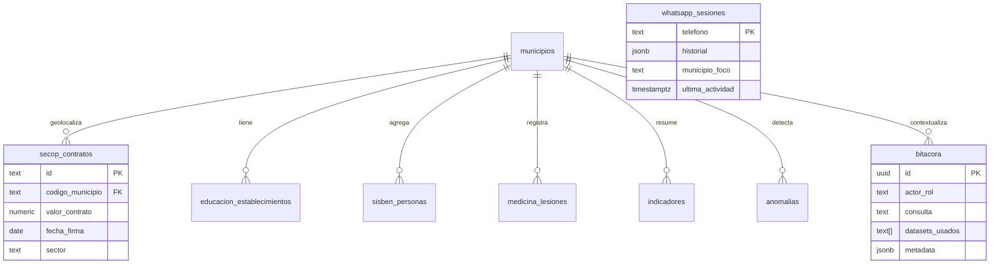
```mermaid
erDiagram
  municipios ||--o{ secop_contratos : geolocaliza
  municipios ||--o{ educacion_establecimientos : tiene
  municipios ||--o{ sisben_personas : agrega
  municipios ||--o{ medicina_lesiones : registra
  municipios ||--o{ indicadores : resume
  municipios ||--o{ anomalias : detecta
  municipios ||--o{ bitacora : contextualiza
  whatsapp_sesiones {
    text telefono PK
    jsonb historial
    text municipio_foco
    timestamptz ultima_actividad
  }
  secop_contratos {
    text id PK
    text codigo_municipio FK
    numeric valor_contrato
    date fecha_firma
    text sector
  }
  bitacora {
    uuid id PK
    text actor_rol
    text consulta
    text[] datasets_usados
    jsonb metadata
  }
```

Tablas principales documentadas en `supabase/schema*.sql`:

- `municipios`
- `secop_contratos`
- `educacion_establecimientos`
- `sisben_personas`
- `medicina_lesiones`
- `indicadores`
- `anomalias`
- `bitacora`
- `whatsapp_sesiones`

Las agregaciones pesadas se hacen server-side para reducir transferencia, evitar lógica duplicada en cliente y mantener una fuente única de cálculo.

## Innovación Técnica

BRÚJULA no innova por poner un chatbot sobre una base de datos. Su diferencia técnica está en unir piezas que normalmente se evalúan por separado:

- contratación pública + vulnerabilidad + educación + violencia en una misma llave territorial;
- agente con herramientas reales, no respuestas libres sin fuente;
- búsqueda viva en datos.gov.co para ampliar evidencia;
- bitácora como memoria institucional;
- clasificación híbrida de objetos contractuales;
- score auditable con salvedades de calidad de dato;
- simulador con supuestos explícitos;
- exportaciones reutilizables;
- PWA y acceso por WhatsApp;
- brief PDF con citaciones verificables.

## Impacto y Escalabilidad

Impacto actual:

- cobertura del Pacífico colombiano: 178 municipios;
- actores: ciudadanía, alcaldías, periodistas, analistas, organizaciones territoriales;
- preguntas habilitadas: inversión, vulnerabilidad, brechas, sectores, zonas críticas, evidencia exportable.

Escalabilidad:

- otros departamentos con DIVIPOLA y datasets compatibles;
- nuevas dimensiones como salud, conectividad, ambiente o seguridad alimentaria;
- despliegues territoriales con Supabase/Vercel;
- APIs de consulta pública;
- white-label para entidades;
- internacionalización a portales Socrata compatibles.

Estas son rutas de escalamiento, no integraciones ya implementadas salvo que el código lo demuestre.

## Accesibilidad y Brecha Digital

BRÚJULA contempla varios niveles de acceso:

- vista ciudadana y vista funcionario;
- lenguaje natural mediante copiloto;
- WhatsApp para consulta sin computador;
- PWA con paquetes territoriales guardados localmente;
- diseño responsive;
- exportaciones CSV/ZIP;
- enlaces a fuentes verificables.

## IA Responsable

| Riesgo | Mitigación | Evidencia |
|---|---|---|
| Alucinación de cifras | El agente debe consultar herramientas reales | `lib/agent/tools.ts`, `lib/agent/system-prompt.ts` |
| Confundir score con verdad administrativa | Advertencias metodológicas y categorías de calidad | `docs/CRISP-ML.md`, `lib/queries/zonas.ts` |
| Causalidad indebida | Simulador se declara escenario, no predicción | `lib/queries/simulador.ts`, `/simulador` |
| Subregistro municipal | `calidad_dato_secop` distingue `ok`, `cero_verificado`, `posible_subregistro` | SQL de zonas y consultas |
| Exposición de datos personales | Uso agregado de Sisbén; secretos server-side | `docs/DATOS.md`, `.env.example`, rutas API |
| Memoria institucional opaca | Bitácora con consulta, herramientas y datasets | `supabase/schema.sql`, `/bitacora` |
| Clasificación errada | Sectores aproximados, verificables contra SECOP | `lib/clasificacion` |

## Rigor de Datos

| Problema | Diagnóstico | Corrección | Aprendizaje |
|---|---|---|---|
| Columnas reales de SECOP | Los nombres útiles no siempre coinciden con supuestos iniciales | Scripts `inspect-secop.ts` y parsers específicos | Primero inspeccionar, luego modelar |
| Municipios sin código claro | SECOP requiere enriquecimiento territorial | `enrich-divipola*.ts`, matcher DIVIPOLA | La llave geográfica define la calidad del cruce |
| Paginación y truncamiento | APIs y Supabase pueden limitar resultados | paginación en ingestas y validadores | Las métricas globales deben validarse por conteo |
| Factor `fex` | Sisbén no debe tratarse como conteo simple sin ponderación | `inspect-fex.ts`, `enrich-sisben-poblacion.ts` | La vulnerabilidad necesita ponderación responsable |
| Filtro temporal | SECOP tiene fechas; educación/Sisbén son snapshots o inventarios | `docs/ANALISIS-PERIODO.md` | No todos los indicadores admiten el mismo filtro |
| Coordenadas y outliers | El mapa requiere coordenadas confiables | `audit-coords.ts`, `fix-coords.ts`, `seed-coordenadas.ts` | Visualizar mal también es desinformar |
| Dirección del simulador | Un escenario no debe venderse como predicción | lógica de `lib/queries/simulador.ts` | La honestidad metodológica es parte del producto |

## Alineación con el Concurso

| Criterio | Puntaje posible | Evidencia BRÚJULA | Módulos | Documentación |
|---|---:|---|---|---|
| Innovación y creatividad | 20 | Cruce territorial, agente con herramientas, score auditable, WhatsApp/PWA | `/agente`, `/zonas-olvidadas`, `/offline` | README, arquitectura |
| Uso de datos abiertos | 20 | SECOP, Sisbén, Educación, Medicina Legal, DIVIPOLA y catálogo Socrata | todos | `docs/DATOS.md` |
| Análisis y rigor técnico | 20 | CRISP-ML, validaciones, score, salvedades, clasificación | `/radar`, `/simulador`, `/bitacora` | `docs/CRISP-ML.md` |
| Impacto y escalabilidad | 20 | Pacífico completo, acceso ciudadano, rutas de expansión | `/dashboard`, `/whatsapp` | README, deploy |
| Tecnologías emergentes e IA | 10 | Claude con tool use, clasificación LLM, agente en WhatsApp | `/agente`, webhook | `docs/ARQUITECTURA.md` |
| Diseño, comunicación y usabilidad | 10 | Interfaz brutal-gov, capturas reales, lenguaje ciudadano | web y móvil | assets README |

Checklist de entregables:

| Entregable | Estado | Nota |
|---|---|---|
| Solución funcional | Listo | Demo en Vercel |
| Repositorio público | Listo | GitHub |
| Documentación técnica | Listo | `docs/` y README |
| Metodología | Listo | CRISP-ML y score |
| Arquitectura | Listo | `docs/ARQUITECTURA.md` |
| Evidencia de datos abiertos | Listo | datasets e IDs |
| Impacto | Listo | módulos y hallazgos |
| Publicación en datos.gov.co/usos | Pendiente | No se encontró URL real en el repo |
| Presentación | Pendiente | No hay deck versionado |
| Video demo | No aplica | La evidencia visual son demo en producción y capturas reproducibles |

## Recorrido para Jurados

Recorrido recomendado de 5 minutos:

| Tiempo | Acción |
|---:|---|
| 00:00 | Leer hallazgo de Argelia y la salvedad metodológica |
| 00:40 | Abrir `/zonas-olvidadas` y revisar ranking, score y calidad del dato |
| 01:30 | Abrir `/agente` y observar herramientas disponibles sin necesidad de consulta costosa |
| 02:20 | Abrir `/mi-plata` para Tumaco y revisar desglose sectorial |
| 03:00 | Comparar Tumaco vs Cali en `/comparador` o revisar escenario en `/simulador` |
| 03:40 | Abrir `/brief`; probar PDF solo después de verificar el deployment de la función |
| 04:15 | Revisar `/whatsapp` y `/offline` como respuesta a brecha digital |
| 04:45 | Cerrar con `/bitacora`, fuentes y documentación |

## Stack

| Capa | Tecnología |
|---|---|
| Frontend | Next.js `16.2.4`, React `19.2.4`, TypeScript `^5`, Tailwind CSS v4 |
| Cartografía | Leaflet `^1.9.4`, React Leaflet `^5.0.0` |
| Backend | Next.js App Router, API routes, Node.js runtime |
| Datos | Supabase JS `^2.105.1`, Supabase SSR `^0.10.2`, PostgreSQL |
| IA | `@anthropic-ai/sdk ^0.92.0` |
| PDF | `puppeteer-core 25.1.0`, `@sparticuz/chromium 149.0.0` |
| PWA | `public/manifest.json`, `public/sw.js`, `idb-keyval ^6.2.6` |
| WhatsApp | `twilio ^6.0.2` |
| Export | `jszip ^3.10.1`, CSV local |
| Deploy | Vercel, Node `22.x` |
| CI/CD | No hay workflow `.github/workflows` versionado; validar localmente con comandos del repo |

## Estructura del Repositorio

```text
.
├── app/                         # App Router, páginas y API routes
│   ├── api/                     # Endpoints para dashboard, agente, PDF, export, Twilio
│   ├── dashboard/               # Mapa territorial
│   ├── agente/                  # Copiloto IA
│   ├── zonas-olvidadas/         # Ranking y score
│   ├── mi-plata/                # Desglose sectorial ciudadano
│   ├── comparador/              # Comparación municipal
│   ├── simulador/               # Escenarios de inversión
│   ├── radar/                   # Cruce sectorial
│   ├── brief/                   # Generador PDF
│   ├── bitacora/                # Memoria institucional
│   ├── whatsapp/                # Guía pública del canal
│   └── offline/                 # PWA offline
├── components/brujula/          # Sistema visual y componentes de producto
├── lib/                         # Agente, consultas, clasificación, PDF, export, offline, Twilio
├── scripts/                     # Ingesta, enriquecimiento, validación y capturas README
├── supabase/                    # Schema, funciones RPC y SQL de desempeño
├── docs/                        # Arquitectura, metodología, datos, deploy y análisis
└── docs/assets/readme/          # Hero, capturas reales, diagramas y trazabilidad visual
```

## Inicio Rápido

Requisitos:

- Node.js `22.x` para reproducir el entorno objetivo de Vercel;
- npm;
- proyecto Supabase con schema aplicado;
- variables de entorno según la función a probar.

```bash
git clone https://github.com/jpablortiz96/brujula-pacifico.git
cd brujula-pacifico
npm ci
cp .env.example .env.local
npm run dev
```

URL local:

```text
http://localhost:3000
```

Validación:

```bash
npm run typecheck
npm run lint
npm run build
```

Variables:

| Variable | Obligatoria para | Cliente | Sensible |
|---|---|---:|---:|
| `NEXT_PUBLIC_SUPABASE_URL` | UI y consultas públicas Supabase | Sí | No |
| `NEXT_PUBLIC_SUPABASE_ANON_KEY` | UI y cliente Supabase | Sí | No secreta, pero debe ser anon key |
| `SUPABASE_SERVICE_ROLE_KEY` | API routes server-side, ingestas, PDF/export cuando requieren privilegios | No | Sí |
| `ANTHROPIC_API_KEY` | Agente y clasificación LLM | No | Sí |
| `TWILIO_ACCOUNT_SID` | Webhook/validación Twilio | No | Sí |
| `TWILIO_AUTH_TOKEN` | Webhook/validación Twilio | No | Sí |
| `TWILIO_WHATSAPP_FROM` | Respuestas WhatsApp | No | Sí operativo |
| `NEXT_PUBLIC_APP_URL` | URLs absolutas y entorno | Sí | No |

No publiques valores reales en README, issues, capturas ni commits.

## Reproducción de Datos

Orden recomendado para un entorno controlado:

```bash
# 1. Aplicar SQL en Supabase
#    supabase/schema.sql
#    supabase/schema-datasets.sql
#    supabase/schema-whatsapp.sql
#    supabase/functions*.sql

npm run seed:pacifico
npm run seed:coordenadas
npm run ingest:secop
npm run ingest:all-datasets
npm run enrich:multi
npm run enrich:sisben-poblacion
npm run clasificar:dry
npm run clasificar:sectores
npm run validate
npm run validate:sisben-balance
npm run validate:zonas
```

Advertencias:

- consume APIs públicas de datos.gov.co;
- la clasificación LLM puede generar costos;
- no ejecutes ingestas accidentalmente contra producción;
- las ingestas no forman parte del build ni del deployment de Vercel.

## Scripts

<details>
<summary>Ver comandos del proyecto</summary>

| Comando | Propósito | Requiere credenciales | Modifica datos |
|---|---|---:|---:|
| `npm run dev` | Servidor local | Sí, para datos reales | No |
| `npm run build` | Build Next.js | Sí, para rutas que consultan durante build si aplica | No |
| `npm run lint` | ESLint | No | No |
| `npm run typecheck` | TypeScript | No | No |
| `npm run seed:pacifico` | Sembrar municipios del Pacífico | Supabase | Sí |
| `npm run seed:divipola` | Sembrar catálogo DIVIPOLA | Supabase | Sí |
| `npm run seed:coordenadas` | Sembrar coordenadas | Supabase | Sí |
| `npm run ingest:secop` | Ingesta SECOP | Supabase, datos.gov.co | Sí |
| `npm run ingest:secop-nuevos` | Ingesta incremental SECOP | Supabase, datos.gov.co | Sí |
| `npm run ingest:educacion` | Ingesta MEN | Supabase, datos.gov.co | Sí |
| `npm run ingest:sisben` | Ingesta Sisbén | Supabase, datos.gov.co | Sí |
| `npm run ingest:medicina` | Ingesta Medicina Legal | Supabase, datos.gov.co | Sí |
| `npm run ingest:all-datasets` | Ingesta educación, Sisbén y Medicina | Supabase, datos.gov.co | Sí |
| `npm run enrich:divipola` | Enriquecer códigos territoriales | Supabase | Sí |
| `npm run enrich:multi` | Enriquecimiento combinado | Supabase | Sí |
| `npm run enrich:sisben-poblacion` | Estimar población vulnerable con `fex` | Supabase | Sí |
| `npm run clasificar:dry` | Ensayo de clasificación sectorial | Anthropic si fallback | No intencional |
| `npm run clasificar:sectores` | Clasificar contratos | Anthropic si fallback | Sí |
| `npm run validate` | Validación general | Supabase | No |
| `npm run validate:sisben-balance` | Validación Sisbén/fex | Supabase | No |
| `npm run validate:zonas` | Validación score de zonas | Supabase | No |
| `npm run smoke:pdf` | Prueba básica de PDF | Variables de app | Puede generar archivo temporal |
| `npx tsx scripts/capture-readme-screenshots.ts` | Capturas README | No | Escribe imágenes en `docs/assets/readme/screenshots` |

</details>

## Deployment

BRÚJULA está preparada para Vercel con detección automática de Next.js. No requiere `vercel.json` salvo una necesidad futura específica.

Configuración:

| Campo Vercel | Valor |
|---|---|
| Framework Preset | Next.js |
| Root Directory | raíz del repositorio |
| Build Command | `npm run build` |
| Install Command | `npm ci` |
| Output Directory | `.next` automático |
| Node.js | `22.x` |

Rutas con runtime Node.js:

- agente Anthropic;
- webhook Twilio;
- generación PDF/Chromium;
- exportación/ZIP cuando aplica;
- operaciones server-side prolongadas.

```mermaid
flowchart LR
  GH[GitHub] --> V[Vercel auto-detect Next.js]
  GH -. pendiente si se activa .github/workflows .-> CI[GitHub Actions]
  CI -. validaría .-> Checks[lint / typecheck / build]
  V --> NF[Next.js Functions Node.js]
  NF --> DB[(Supabase)]
  NF --> A[Anthropic]
  NF --> T[Twilio webhook]
  NF --> C[Chromium para PDF]
  NF --> S[Socrata datos.gov.co]
```

Twilio webhook:

```text
POST https://brujula-pacifico.vercel.app/api/whatsapp/webhook
```

Documentación completa: [docs/DEPLOY.md](docs/DEPLOY.md) y [docs/WHATSAPP.md](docs/WHATSAPP.md).

## Calidad y CI

Comandos reales:

```bash
npm run typecheck
npm run lint
npm run build
```

Validaciones de datos:

```bash
npm run validate
npm run validate:sisben-balance
npm run validate:zonas
```

No hay suite de tests unitarios ni workflow `.github/workflows` versionado en este snapshot. Por eso el README no muestra badge de CI ni cobertura.

## Documentación

| Documento | Propósito |
|---|---|
| [docs/ARQUITECTURA.md](docs/ARQUITECTURA.md) | Arquitectura técnica |
| [docs/CRISP-ML.md](docs/CRISP-ML.md) | Metodología CRISP-ML(Q) |
| [docs/DATOS.md](docs/DATOS.md) | Fuentes, datasets y principios de datos |
| [docs/ANALISIS-PERIODO.md](docs/ANALISIS-PERIODO.md) | Análisis de periodos y filtros temporales |
| [docs/DEPLOY.md](docs/DEPLOY.md) | Despliegue Vercel y Chromium |
| [docs/WHATSAPP.md](docs/WHATSAPP.md) | Configuración y arquitectura WhatsApp |
| [docs/capturas/README.md](docs/capturas/README.md) | Capturas/documentación visual previa |
| [docs/assets/readme/README-ASSETS.md](docs/assets/readme/README-ASSETS.md) | Capturas reales del README |

## Roadmap

Listo:

- dashboard territorial;
- agente con 9 herramientas;
- detector de zonas olvidadas;
- comparador;
- simulador;
- Mi Plata;
- radar sectorial;
- generador de brief PDF implementado;
- bitácora;
- WhatsApp Sandbox;
- PWA/offline;
- exportaciones.

En validación:

- estabilidad del PDF en Vercel Functions después de cada deployment;
- calidad de georreferenciación SECOP;
- clasificación sectorial para objetos ambiguos;
- usabilidad móvil en todos los módulos densos.

Siguiente:

- workflow CI real en GitHub Actions;
- checklist público de demo guiada dentro del README;
- publicación en datos.gov.co/usos si el concurso lo exige;
- pruebas automatizadas de humo para rutas críticas;
- tablero de calidad de datos por fuente.

Visión futura:

- nuevos departamentos;
- datasets de salud y conectividad;
- API pública de consultas agregadas;
- despliegues para entidades territoriales;
- soporte para otros portales Socrata.

## Contribución

Antes de abrir un PR:

```bash
npm ci
npm run typecheck
npm run lint
npm run build
```

Convenciones:

- abrir ramas descriptivas;
- no subir `.env`, llaves ni credenciales;
- documentar cambios metodológicos;
- no cambiar fórmulas, RPC o ingestas sin explicar impacto;
- incluir capturas o pruebas de humo cuando se modifique UI crítica;
- proteger datos personales y mantener Sisbén en agregados.

No existe `CODE_OF_CONDUCT.md` en este snapshot; aplica conducta profesional básica en issues y PRs.

## Licencia y Autoría

Licencia: [MIT](LICENSE).

Autoría del proyecto: [Juan Pablo Ortiz](https://github.com/jpablortiz96).

BRÚJULA reconoce a las entidades dueñas de las fuentes públicas: Colombia Compra Eficiente, DNP/Prosperidad Social, Ministerio de Educación Nacional, Instituto Nacional de Medicina Legal, DANE y datos.gov.co.

BRÚJULA no representa oficialmente a MinTIC, datos.gov.co ni a las entidades fuente, salvo autorización explícita.

## Cierre

Datos.gov.co tiene la información. BRÚJULA tiene el criterio.

Explora la demo, revisa la metodología, audita las fuentes y reutiliza el proyecto para convertir datos abiertos en decisiones públicas verificables.
